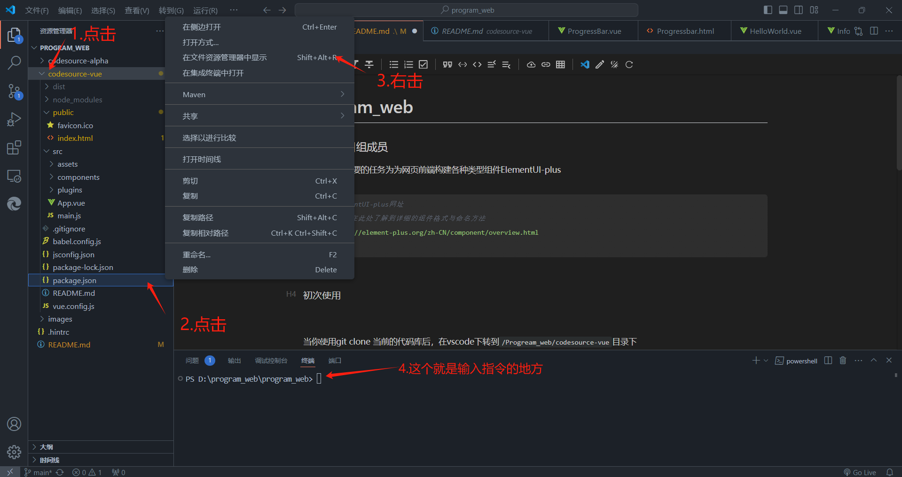
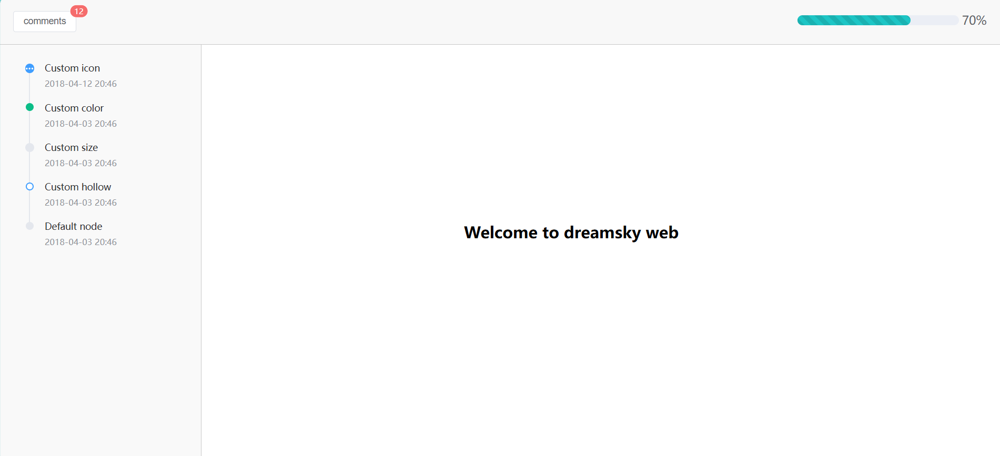

# program_web

### 致各位项目组成员

目前我们的主要的任务为为网页前端构建各种类型组件ElementUI-plus

```
#ElementUI-plus网址
#可以在此处了解到详细的组件格式与命名方法
https://element-plus.org/zh-CN/component/overview.html

```

#### 如果你对如何编写vue组件流程感到困惑或者不知如何编写代码可以阅读以下部分

### 1.初次编写组件

当你使用git clone 当前的代码库后，在vscode下转到`/Progream_web/codesource-vue`目录下



使用

```
npm install
```

即可完成前端开发所需要的所有环境依赖

### 2.代码编写

在前端开发期间，只需增添修改  `/codesoure-vue/src/components` 当中的组件

并在 `/codesoure-vue/src/App.vue` 引用你在 `components` 编辑好的以`.vue`命名的组件刷新网页之后就可以生效

vue的格式要求 (选项式API) 文件后缀名称.vue

```
<template>
  //此处放置html文件
  <div>
    <h1>{{ value }}</h1>
  </div>
</template>

<script>
  //此处为你所需要放置的数据
  export default{
    data(){
      return{
        value: 'Hello World'
      };
    }
  }
</script>

<style>
  //相应的css格式
</style>
```

### 3.网页调试

组件编写完毕或者需要测试的时候

跟初次使用那部分打开终端的步骤一样打开终端

```
# 启动网页（调试）
npm run serve

# 构建网页（一般用不到）
npm run build
```

这样就可以看到自己制作的网页组件了



## Under construction(敬请期待)


Scientific Planning Program web page
